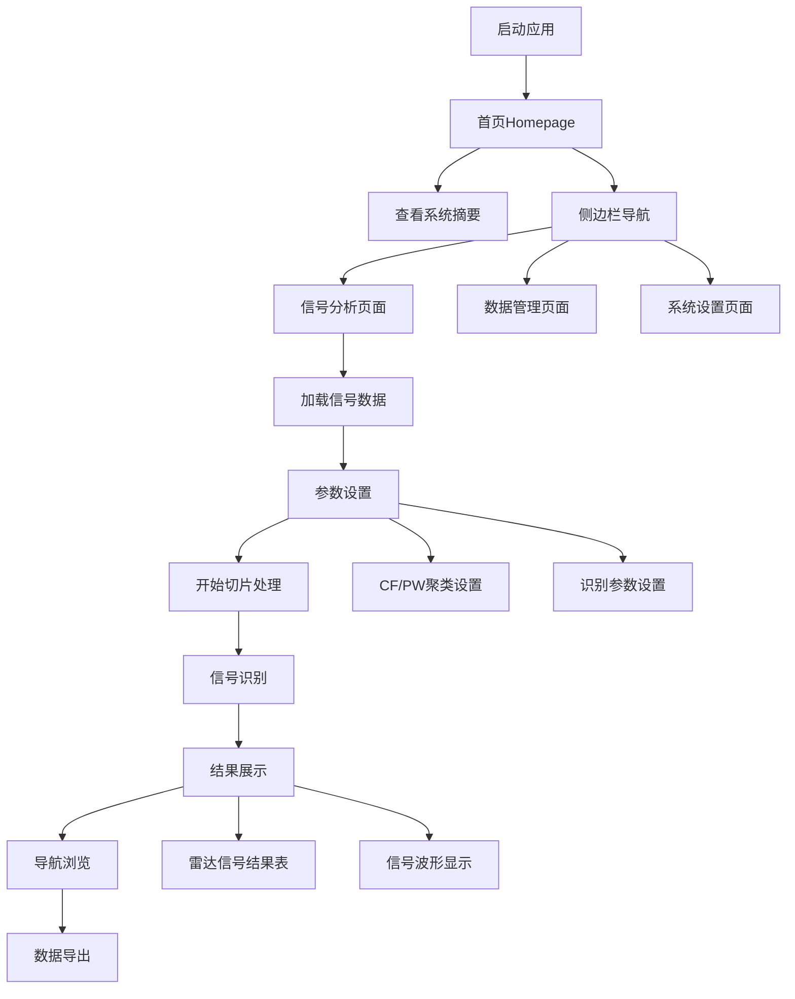

# 雷达信号分析软件产品需求文档

## 1. 产品概述

雷达信号分析软件是一款专业的信号处理和分析工具，用于对雷达信号进行实时监测、参数提取和智能识别。

* 主要解决雷达信号的自动化分析和识别问题，为信号分析工程师提供高效的可视化分析平台。

* 产品将基于Web技术开发，后续通过Electron集成为Windows桌面应用，实现跨平台部署。

## 2. 核心功能

### 2.1 应用特性

本软件为纯本地桌面应用，无需用户注册或登录，启动后直接进入主分析界面。所有功能均可直接使用，包括信号分析、参数设置、数据导出等完整功能。

### 2.2 功能模块

我们的雷达信号分析软件采用可折叠两栏式设计，包含以下主要页面：

1. **首页（Homepage）**：系统状态摘要、最近分析记录、快速操作入口
2. **信号分析页面**：信号显示区域、参数设置面板、控制操作区、结果展示表格
3. **数据管理页面**：历史数据查看、数据导入导出、文件管理
4. **系统设置页面**：参数配置、系统状态监控

### 2.3 界面布局设计

应用采用左右两栏布局：

* **左侧侧边栏**：可折叠的导航菜单，包含首页、信号分析、数据管理、系统设置等功能页面入口

* **右侧主内容区**：显示当前选中页面的具体内容，根据不同页面动态切换内容

### 2.4 页面详情

| 页面名称   | 模块名称        | 功能描述                                           |
| ------ | ----------- | ---------------------------------------------- |
| 首页     | 系统状态摘要      | 显示系统运行状态、CPU/内存使用率、当前处理任务数量等关键指标               |
| 首页     | 最近分析记录      | 展示最近5次信号分析的结果摘要，包括分析时间、信号数量、识别成功率等             |
| 首页     | 快速操作入口      | 提供快速开始新分析、导入数据文件、查看历史记录等常用操作的快捷按钮              |
| 首页     | 侧边栏导航       | 可折叠的左侧导航栏，包含首页、信号分析、数据管理、系统设置等页面入口             |
| 信号分析页面 | 信号显示区域      | 显示载频、脉宽、幅度、级差、方位角等多维度信号数据的实时波形图                |
| 信号分析页面 | CF/PW维度聚类设置 | 配置epsilon\_CF、epsilon\_PW、min\_pts等聚类参数，支持实时调整 |
| 信号分析页面 | 识别参数设置      | 设置PA判别权重、DTOA判别权重、联合判别门限等识别算法参数                |
| 信号分析页面 | 切片处理控制      | 提供开始切片、识别、合并亲单等处理操作，支持全速处理模式                   |
| 信号分析页面 | 导航控制        | 实现下一类、下一片、重置当前切片等数据浏览功能                        |
| 信号分析页面 | 显示模式切换      | 支持显示全部聚类结果或仅显示识别后结果的切换                         |
| 信号分析页面 | 雷达信号识别结果    | 以表格形式展示识别出的雷达信号参数（载频/MHz、脉宽/us、PRI/us、DOA/°等）  |
| 信号分析页面 | 数据包信息       | 显示当前处理的数据包位置和预计获取的切片数量                         |
| 数据管理页面 | 文件操作        | 支持数据文件的导入、导出、删除等管理操作                           |
| 数据管理页面 | 历史记录        | 查看历史分析结果和处理记录                                  |
| 系统设置页面 | 参数配置        | 系统级参数的配置和管理                                    |
| 系统设置页面 | 系统监控        | 系统运行状态和性能监控                                    |

## 3. 核心流程

**主要操作流程：**
启动应用后进入首页，查看系统状态摘要和最近分析记录，通过侧边栏导航进入信号分析页面，加载或导入雷达信号数据，根据信号特征调整CF/PW聚类参数和识别参数，启动切片处理进行信号分析，系统自动进行信号识别并在结果表格中展示识别出的雷达信号参数，用户可通过导航控制查看不同切片的分析结果，最终将分析结果导出保存。

## 4. 用户界面设计

### 4.1 设计风格

* **主色调**：深蓝色 (#4772C3) 作为主色，白色 (#FFFFFF) 作为背景色

* **按钮样式**：现代扁平化设计，圆角矩形按钮，悬停时有阴影效果

* **字体**：微软雅黑 14px 作为主要字体，数据表格使用 12px

* **布局风格**：可折叠两栏布局，左侧为可折叠侧边栏导航，右侧为主内容区域

* **图标风格**：使用简洁的线性图标，配合适当的颜色区分不同功能

### 4.2 页面设计概览

| 页面名称   | 模块名称   | UI元素                                                       |
| ------ | ------ | ---------------------------------------------------------- |
| 全局布局   | 侧边栏导航  | 左侧可折叠导航栏，宽度200px，包含Logo、菜单项和折叠按钮，深蓝色背景                     |
| 全局布局   | 主内容区   | 右侧主要内容区域，自适应宽度，白色背景，根据当前页面显示不同内容                           |
| 首页     | 系统摘要卡片 | 3x2网格布局的状态卡片，显示系统关键指标，使用渐变色背景和图标                           |
| 首页     | 最近记录列表 | 垂直列表布局，每项包含时间、状态、结果摘要，支持点击查看详情                             |
| 首页     | 快速操作区  | 水平排列的大按钮，使用不同颜色和图标，提供常用功能的快速入口                             |
| 信号分析页面 | 信号显示区域 | 10个等大的矩形显示框，2列5行布局，每个框显示不同维度的信号数据，框内有标签标识（载频、脉宽、幅度、级差、方位角） |
| 信号分析页面 | 参数设置面板 | 右侧垂直布局，包含输入框、标签和单位，使用卡片式设计，参数分组显示                          |
| 信号分析页面 | 控制按钮区  | 水平排列的功能按钮，使用不同颜色区分操作类型（蓝色-处理，绿色-导航，灰色-设置）                  |
| 信号分析页面 | 结果表格   | 标准数据表格，表头使用深蓝色背景，数据行交替显示浅灰色背景，支持排序和筛选                      |
| 信号分析页面 | 状态信息栏  | 顶部显示当前数据包信息和处理状态，使用浅蓝色背景                                   |

