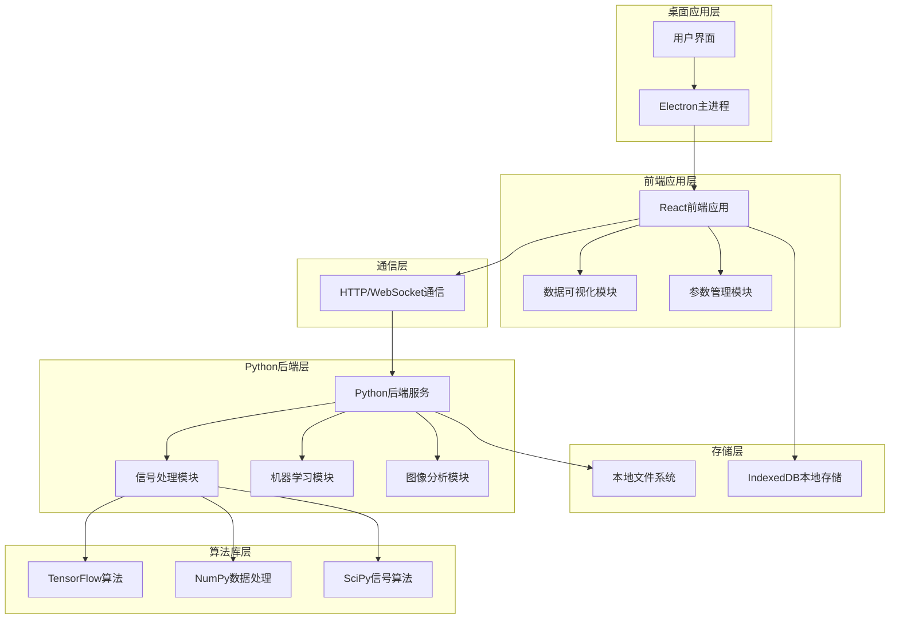
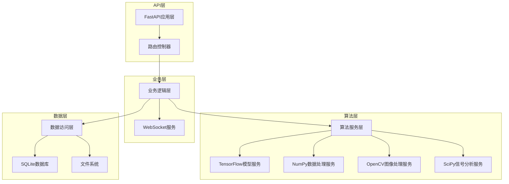
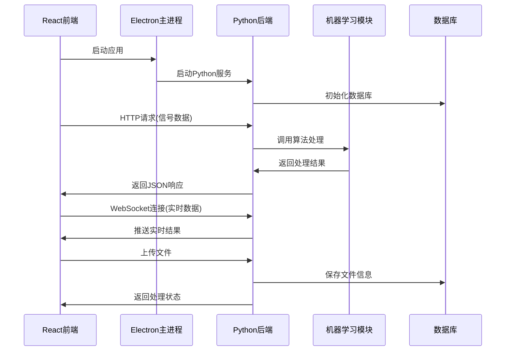
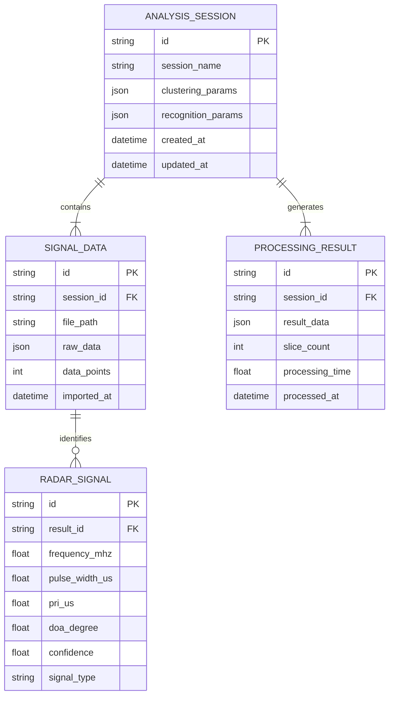

# 雷达信号分析软件技术架构文档

## 1. 架构设计



## 2. 技术描述

* **前端**: React@18 + TypeScript + Tailwind CSS + Vite + Recharts

* **桌面框架**: Electron@latest

* **后端**: Python@3.9+ + FastAPI + uvicorn

* **机器学习**: TensorFlow@2.13+ + Keras

* **数据处理**: NumPy@1.24+ + SciPy@1.10+ + Pandas@2.0+

* **图像分析**: OpenCV@4.8+ + Matplotlib@3.7+ + Pillow@10.0+

* **通信协议**: HTTP REST API + WebSocket实时通信

* **数据存储**: SQLite + IndexedDB + 本地文件系统

* **状态管理**: Zustand

* **UI组件**: Ant Design + 自定义组件

## 3. 路由定义

| 路由               | 用途                     |
| ---------------- | ---------------------- |
| /                | 首页，显示系统状态摘要、最近分析记录和快速操作入口 |
| /signal-analysis | 信号分析页面，包含信号显示、参数设置和结果展示 |
| /data-management | 数据管理页面，历史数据查看和文件管理     |
| /settings        | 系统设置页面，参数配置和系统监控       |

## 4. 核心API定义

### 4.1 Python后端API基础

**API基础配置**

```python
# FastAPI应用配置
from fastapi import FastAPI, WebSocket
from fastapi.middleware.cors import CORSMiddleware

app = FastAPI(title="雷达信号分析API", version="1.0.0")

# 允许前端跨域访问
app.add_middleware(
    CORSMiddleware,
    allow_origins=["http://localhost:3000"],  # Electron前端地址
    allow_credentials=True,
    allow_methods=["*"],
    allow_headers=["*"],
)
```

### 4.2 信号处理API

**信号数据加载**

```typescript
interface SignalData {
  frequency: number[];     // 载频数据
  pulseWidth: number[];   // 脉宽数据
  amplitude: number[];    // 幅度数据
  levelDiff: number[];    // 级差数据
  azimuth: number[];      // 方位角数据
  timestamp: number[];    // 时间戳
}

interface LoadSignalRequest {
  filePath: string;
  dataFormat: 'binary' | 'csv' | 'json';
}

interface LoadSignalResponse {
  success: boolean;
  data?: SignalData;
  error?: string;
}
```

**聚类参数设置**

```typescript
interface ClusteringParams {
  epsilon_CF: number;      // CF维度聚类参数
  epsilon_PW: number;      // PW维度聚类参数
  min_pts: number;         // 最小点数
}

interface RecognitionParams {
  PA_weight: number;       // PA判别权重
  DTOA_weight: number;     // DTOA判别权重
  joint_threshold: number; // 联合判别门限
}
```

**信号识别结果**

```typescript
interface RadarSignal {
  id: string;
  frequency_mhz: number;   // 载频/MHz
  pulseWidth_us: number;   // 脉宽/us
  pri_us: number;          // PRI/us
  doa_degree: number;      // DOA/°
  confidence: number;      // 识别置信度
  signalType: string;      // 信号类型
}

interface ProcessingResult {
  signals: RadarSignal[];
  processingTime: number;
  sliceCount: number;
  currentSlice: number;
}
```

### 4.3 机器学习API

**信号分类和识别**

```python
from typing import List, Optional
from pydantic import BaseModel
import tensorflow as tf
import numpy as np

class MLModelRequest(BaseModel):
    signal_data: List[float]     # 信号数据
    model_type: str              # 模型类型: 'classification' | 'clustering' | 'detection'
    confidence_threshold: float = 0.8  # 置信度阈值

class MLModelResponse(BaseModel):
    predictions: List[dict]      # 预测结果
    confidence_scores: List[float]  # 置信度分数
    processing_time: float       # 处理时间
    model_version: str           # 模型版本

@app.post("/api/ml/predict")
async def predict_signal_type(request: MLModelRequest) -> MLModelResponse:
    """使用机器学习模型进行信号类型预测"""
    pass

@app.post("/api/ml/train")
async def train_model(training_data: dict) -> dict:
    """训练或更新机器学习模型"""
    pass
```

**聚类分析API**

```python
class ClusteringRequest(BaseModel):
    signal_features: List[List[float]]  # 信号特征矩阵
    algorithm: str = 'dbscan'           # 聚类算法: 'dbscan' | 'kmeans' | 'hierarchical'
    parameters: dict                    # 算法参数

class ClusteringResponse(BaseModel):
    cluster_labels: List[int]           # 聚类标签
    cluster_centers: List[List[float]]  # 聚类中心
    silhouette_score: float             # 轮廓系数
    n_clusters: int                     # 聚类数量

@app.post("/api/ml/clustering")
async def perform_clustering(request: ClusteringRequest) -> ClusteringResponse:
    """执行信号聚类分析"""
    pass
```

### 4.4 图像分析API

**信号图像处理**

```python
from PIL import Image
import cv2
import matplotlib.pyplot as plt

class ImageAnalysisRequest(BaseModel):
    image_data: str                     # Base64编码的图像数据
    analysis_type: str                  # 分析类型: 'spectrum' | 'waterfall' | 'constellation'
    parameters: Optional[dict] = None   # 分析参数

class ImageAnalysisResponse(BaseModel):
    processed_image: str                # 处理后的图像(Base64)
    analysis_results: dict              # 分析结果
    detected_features: List[dict]       # 检测到的特征
    processing_time: float              # 处理时间

@app.post("/api/image/analyze")
async def analyze_signal_image(request: ImageAnalysisRequest) -> ImageAnalysisResponse:
    """分析信号图像并提取特征"""
    pass

@app.post("/api/image/generate")
async def generate_signal_plot(signal_data: dict) -> dict:
    """根据信号数据生成可视化图像"""
    pass
```

### 4.5 实时通信API

**WebSocket实时数据传输**

```python
from fastapi import WebSocket, WebSocketDisconnect
import json
import asyncio

class ConnectionManager:
    def __init__(self):
        self.active_connections: List[WebSocket] = []
    
    async def connect(self, websocket: WebSocket):
        await websocket.accept()
        self.active_connections.append(websocket)
    
    def disconnect(self, websocket: WebSocket):
        self.active_connections.remove(websocket)
    
    async def broadcast(self, message: str):
        for connection in self.active_connections:
            await connection.send_text(message)

manager = ConnectionManager()

@app.websocket("/ws/realtime")
async def websocket_endpoint(websocket: WebSocket):
    """实时数据传输WebSocket端点"""
    await manager.connect(websocket)
    try:
        while True:
            data = await websocket.receive_text()
            # 处理实时数据
            response = await process_realtime_data(json.loads(data))
            await websocket.send_text(json.dumps(response))
    except WebSocketDisconnect:
        manager.disconnect(websocket)
```

### 4.6 首页数据API

**系统状态获取**

```typescript
interface SystemStatus {
  cpu_usage: number;          // CPU使用率
  memory_usage: number;       // 内存使用率
  active_tasks: number;       // 当前处理任务数量
  system_uptime: number;      // 系统运行时间（秒）
  last_analysis_time: string; // 最后分析时间
}

interface RecentAnalysisRecord {
  id: string;
  analysis_time: string;      // 分析时间
  signal_count: number;       // 信号数量
  success_rate: number;       // 识别成功率
  processing_time: number;    // 处理耗时（秒）
  file_name: string;          // 数据文件名
}

interface HomepageData {
  system_status: SystemStatus;
  recent_records: RecentAnalysisRecord[];
  quick_actions: QuickAction[];
}

interface QuickAction {
  id: string;
  title: string;
  description: string;
  icon: string;
  route: string;
}
```

### 4.7 数据管理API

**文件操作**

```typescript
interface FileOperation {
  action: 'import' | 'export' | 'delete';
  filePath: string;
  data?: any;
}

interface FileOperationResponse {
  success: boolean;
  message: string;
  filePath?: string;
}
```

## 5. 服务器架构图

### 5.1 Python后端架构



### 5.2 前后端通信架构



## 6. 数据模型

### 6.1 数据模型定义



### 6.2 Python后端数据库设计

**SQLite数据库表结构**

```sql
-- 分析会话表
CREATE TABLE analysis_sessions (
    id INTEGER PRIMARY KEY AUTOINCREMENT,
    session_name VARCHAR(255) NOT NULL,
    clustering_params TEXT,  -- JSON格式存储聚类参数
    recognition_params TEXT, -- JSON格式存储识别参数
    created_at TIMESTAMP DEFAULT CURRENT_TIMESTAMP,
    updated_at TIMESTAMP DEFAULT CURRENT_TIMESTAMP
);

-- 信号数据表
CREATE TABLE signal_data (
    id INTEGER PRIMARY KEY AUTOINCREMENT,
    session_id INTEGER,
    file_path VARCHAR(500),
    file_size INTEGER,
    data_format VARCHAR(50),
    data_points INTEGER,
    imported_at TIMESTAMP DEFAULT CURRENT_TIMESTAMP,
    FOREIGN KEY (session_id) REFERENCES analysis_sessions(id)
);

-- 处理结果表
CREATE TABLE processing_results (
    id INTEGER PRIMARY KEY AUTOINCREMENT,
    session_id INTEGER,
    result_data TEXT,        -- JSON格式存储结果数据
    slice_count INTEGER,
    processing_time REAL,
    algorithm_version VARCHAR(50),
    processed_at TIMESTAMP DEFAULT CURRENT_TIMESTAMP,
    FOREIGN KEY (session_id) REFERENCES analysis_sessions(id)
);

-- 雷达信号表
CREATE TABLE radar_signals (
    id INTEGER PRIMARY KEY AUTOINCREMENT,
    result_id INTEGER,
    frequency_mhz REAL,
    pulse_width_us REAL,
    pri_us REAL,
    doa_degree REAL,
    confidence REAL,
    signal_type VARCHAR(100),
    ml_model_version VARCHAR(50),
    FOREIGN KEY (result_id) REFERENCES processing_results(id)
);

-- 机器学习模型表
CREATE TABLE ml_models (
    id INTEGER PRIMARY KEY AUTOINCREMENT,
    model_name VARCHAR(255),
    model_type VARCHAR(100),
    model_path VARCHAR(500),
    version VARCHAR(50),
    accuracy REAL,
    training_date TIMESTAMP,
    is_active BOOLEAN DEFAULT 0
);

-- 系统日志表
CREATE TABLE system_logs (
    id INTEGER PRIMARY KEY AUTOINCREMENT,
    log_level VARCHAR(20),
    message TEXT,
    module_name VARCHAR(100),
    created_at TIMESTAMP DEFAULT CURRENT_TIMESTAMP
);
```

### 6.3 本地存储结构

**IndexedDB存储设计**

```javascript
const analysisSessionStore = {
  keyPath: 'id',
  autoIncrement: true,
  indexes: {
    'session_name': { unique: false },
    'created_at': { unique: false }
  }
};

// 信号数据存储
const signalDataStore = {
  keyPath: 'id',
  autoIncrement: true,
  indexes: {
    'session_id': { unique: false },
    'file_path': { unique: false },
    'imported_at': { unique: false }
  }
};

// 处理结果存储
const processingResultStore = {
  keyPath: 'id',
  autoIncrement: true,
  indexes: {
    'session_id': { unique: false },
    'processed_at': { unique: false }
  }
};

// 雷达信号存储
const radarSignalStore = {
  keyPath: 'id',
  autoIncrement: true,
  indexes: {
    'result_id': { unique: false },
    'frequency_mhz': { unique: false },
    'signal_type': { unique: false }
  }
};
```

**本地文件存储结构**

```
app_data/
├── signal_files/          # 原始信号数据文件
│   ├── session_001/
│   ├── session_002/
│   └── ...
├── export_data/           # 导出的分析结果
│   ├── results_001.json
│   ├── results_002.csv
│   └── ...
├── ml_models/             # 机器学习模型文件
│   ├── signal_classifier.h5
│   ├── clustering_model.pkl
│   └── feature_extractor.onnx
├── temp_images/           # 临时图像文件
│   ├── spectrum_plots/
│   ├── waterfall_plots/
│   └── analysis_charts/
├── database/              # 数据库文件
│   ├── radar_analysis.db
│   └── backup/
├── config/                # 配置文件
│   ├── app_settings.json
│   ├── user_preferences.json
│   ├── ml_config.json
│   └── api_config.json
└── logs/                  # 日志文件
    ├── app.log
    ├── api.log
    ├── ml_processing.log
    └── error.log
```

### 6.4 Python后端项目结构

```
backend/
├── main.py                # FastAPI应用入口
├── requirements.txt       # Python依赖包
├── config/
│   ├── __init__.py
│   ├── settings.py        # 应用配置
│   └── database.py        # 数据库配置
├── api/
│   ├── __init__.py
│   ├── routes/
│   │   ├── __init__.py
│   │   ├── signal_processing.py
│   │   ├── machine_learning.py
│   │   ├── image_analysis.py
│   │   └── data_management.py
│   └── dependencies.py    # API依赖注入
├── services/
│   ├── __init__.py
│   ├── signal_processor.py
│   ├── ml_service.py
│   ├── image_service.py
│   └── database_service.py
├── models/
│   ├── __init__.py
│   ├── schemas.py         # Pydantic数据模型
│   └── database_models.py # SQLAlchemy数据库模型
├── algorithms/
│   ├── __init__.py
│   ├── signal_analysis.py
│   ├── clustering.py
│   ├── classification.py
│   └── feature_extraction.py
├── utils/
│   ├── __init__.py
│   ├── file_handler.py
│   ├── image_utils.py
│   └── logger.py
└── tests/
    ├── __init__.py
    ├── test_api.py
    ├── test_algorithms.py
    └── test_services.py
```

